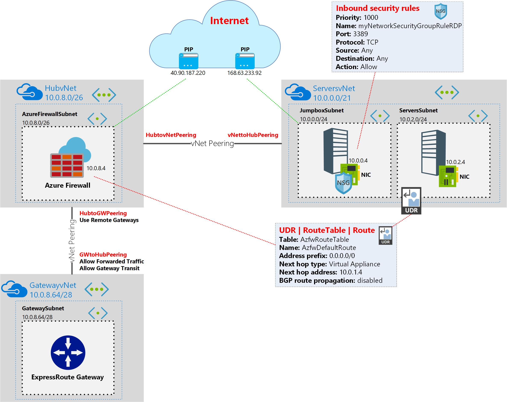

# Create AzureFirewall using an Azure ARM template - Gov

**Gov** means you don't trust sending traffic out to the internet from within Azure, all traffic comes back on-prem with forced tunneling  

This template creates 3 virtual networks (Servers vNet, Gateway vNet and a Hub vNet for an Azure Firewall). Also inclueded is a jumpbox VM with public IP with RDP access.

Also created is a server VM with only a private IP, UDR route to point to AzureFirewall for the **ServersSubnet** and an AzureFirewall with 1 sample application rule (allowing *microsoft.com), 1 NAT rule for access to the **Server** uring port translation, port 3391 to port 3389 and 1 sample network rule.

Azure Firewall is a managed cloud-based network security service that protects your Azure Virtual Network resources.

It is a fully stateful firewall as a service with built-in high availability and unrestricted cloud scalability.

You can centrally create, enforce, and log application and network connectivity policies across subscriptions and virtual network.

Azure Firewall uses a static public IP address for your virtual network resources allowing outside firewalls to identify traffic originating from your virtual network.

The service is fully integrated with Azure Monitor for logging and analytics. Learn more at https://docs.microsoft.com/en-us/azure/firewall.